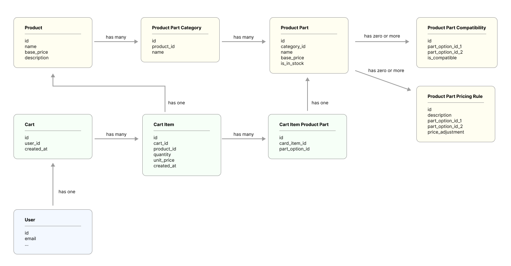

# Bike Data Modeling

This repository implements the base models for a database built for a bicycles ecommerce website.



An SQL representation of this database is stored in [assets/dbstructure.sql](./assets/dbstructure.sql)

## Included

- Models for each database table, which inherit a base model that includes options to fetch data from the DB (`getAll`, `findById`, ...)
- An in-memory database is used to be able to send static data during tests. Tests can be run with `npm run test`, but due to how code is implemented, a web server should be able to inject a SQL implementation of the DB for the actual application
- An example presenter, returns data as it would be returned from the `/products/:id` API endpoint

## TO DO

This code is nowhere near complete yet, here are some suggested next steps and known issues/limitations...

**Users & sessions**

There's no concept of users and sessions whatsoever included in the code. We know that at least we would need two kind of users: customers and admins. How to achieve that and how that would look like in the database was not included in scope.

**Web Server and API**

A web server should be made to register "routes", which would point to "controllers" which would need to validate certain things (like user permissions) before returning data.

The controllers could call the presenters to format DB data. I.e. the `/api/product/:id` route could call a `ApiProductController` which in turn calls a `ProductPresenter` to format the product data in a way that's useful to render the single product page.

**Database**

Currently the code uses an `InMemoryDatabase` for tests, but is adapted to switch that to another implementation if needed. There is even the `database/SQLDatabase.ts` file as a placeholder to add a real DB connection, but that was not included in scope for this exercise.

The database can be switched in the future like this:

Tests:

```
beforeEach(() => {
  setGlobalContext({
    database: new InMemoryDatabase({...})
  });
});
```

Web server entrypoint:

```
setGlobalContext({
  database: new SQLDatabase({...})
});
```

**Admin operations**

Currently there's no possibility of creating "CRUD" endpoints, since `create`, `update` and `delete` methods are missing from `BaseModel`. Implementing these methods, as well as a backoffice interface for updating the product db, seeing orders, etc., would be necessary in the future, so that products can be added in a more user-friendly way, instead of directly executing SQL queries on the database. Of course there are also authorization implications, possibly users should have an "admin" role which would be validated by the controllers before manipulating data.

**Adding a product to the cart**

There's a `Cart.addCartItem` method, which creates new `CartItem` and `CartItemProductPart` instances. However, these instances are not saved anywhere, since there implementation of `.create` is just pseudocode. Also, the price calculation and part compatibility checks are only implemented in "pseudocode", but there's no real implementation.

**Floating-point math**

Floating-point math is dangerous. A suggestion from the "pseudocode" of the `Cart.calculateCartItemPrice` pseudocode is to multiply all prices by 100 before manipulating them, and divide them by 100 before saving them. However this is manual and error-prone. Perhaps there should be something like a "Price Value Object" which enforces strict rules on how prices should be manipulated.

**N+1 problem in queries**

There's no way of saying "get all the cart items of this cart, and all the cart item product parts of each cart item" without doing N+1 queries. At this point we might want to use a proper ORM library, since this is not a simple problem to solve. However I intentionally tried to keep the code dependency free so that optimization is not available in the current implementation.

# About the code

Parts of the code were written by [aider.chat](https://aider.chat), using the Claude Sonet LLM model, using prompts provided by the author. Code authored by aider is marked as `AeonFr (aider)` in the git commit message. I purposefully tried to avoid aider to influence my thinking so I did the first implementation of the first models and tests myself, and after that aider helped me did the more repetitive tasks of adding boilerplate. All AI-generated code is checked and I can defend it as if I've written it myself, obviously. I do not use any kind of autocomplete in my editor so it's quite easy to see which code is written by AI and which is not, using git blame ;)
